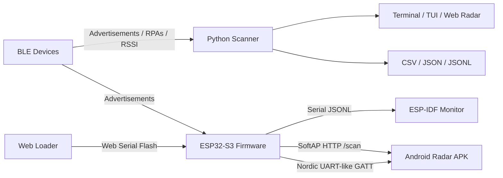

# gh0st-bLe

<div align="center">

```text
 ██████╗ ██╗  ██╗ ██████╗ ███████╗████████╗      ██████╗ ██╗     ███████╗
██╔════╝ ██║  ██║██╔═████╗██╔════╝╚══██╔══╝      ██╔══██╗██║     ██╔════╝
██║  ███╗███████║██║██╔██║███████╗   ██║   █████╗██████╔╝██║     █████╗  
██║   ██║██╔══██║████╔╝██║╚════██║   ██║   ╚════╝██╔══██╗██║     ██╔══╝  
╚██████╔╝██║  ██║╚██████╔╝███████║   ██║         ██████╔╝███████╗███████╗
 ╚═════╝ ╚═╝  ╚═╝ ╚═════╝ ╚══════╝   ╚═╝         ╚═════╝ ╚══════╝╚══════╝
```

### BLE reconnaissance • RPA resolution • ESP32 ghost tracking • radar-style visualization


**Inspired by David Kennedy / [@HackingDave](https://twitter.com/HackingDave) at [TrustedSec](https://www.trustedsec.com)**

```text
┌──────────────────────────────────────────────────────────────┐
│  ▄████▄   ██▓███        ▄████▄   ▒█████  ▓█████▄ ▓█████     │
│ ▒██▀ ▀█  ▓██░  ██▒     ▒██▀ ▀█  ▒██▒  ██▒▒██▀ ██▌▓█   ▀     │
│ ▒▓█    ▄ ▓██░ ██▓▒     ▒▓█    ▄ ▒██░  ██▒░██   █▌▒███       │
│ ▒▓▓▄ ▄██▒▒██▄█▓▒ ▒     ▒▓▓▄ ▄██▒▒██   ██░░▓█▄   ▌▒▓█  ▄     │
│ ▒ ▓███▀ ░▒██▒ ░  ░ ██▓ ▒ ▓███▀ ░░ ████▓▒░░▒████▓ ░▒████▒    │
│ ░ ░▒ ▒  ░▒▓▒░ ░  ░ ▒▓▒ ░ ░▒ ▒  ░░ ▒░▒░▒░  ▒▒▓  ▒ ░░ ▒░ ░    │
│   ░  ▒   ░▒ ░      ░▒    ░  ▒     ░ ▒ ▒░  ░ ▒  ▒  ░ ░  ░    │
│ ░        ░░        ░   ░        ░ ░ ░ ▒   ░ ░  ░    ░       │
│ ░ ░                ░   ░ ░          ░ ░     ░       ░  ░    │
│ ░                  ░   ░                  ░                 │
│                                                              │
│                 BUILT BY: cp-c0d3r9                         │
└──────────────────────────────────────────────────────────────┘
```

</div>

---

## ⚡ What is this?

`gh0st-bLe` is a Bluetooth Low Energy reconnaissance and tracking toolkit for discovering nearby BLE devices, resolving privacy-randomized Resolvable Private Addresses (RPAs) with Identity Resolving Keys (IRKs), estimating proximity from RSSI, and visualizing detections through terminal, browser, Android, and ESP32 companion workflows.

It started as a Python BLE scanner. It now includes:

- Cross-platform Python CLI.
- Live terminal TUI.
- Browser radar GUI with a matrix-style field interface.
- ESP32-S3 firmware companion with SoftAP HTTP and Direct BLE GATT transports.
- Native Android radar APK for phone BLE scanning and ESP32 remote detections.
- Local ESP Web Tools flasher for browser-based ESP32-S3 flashing.

> **Authorized testing only.** BLE privacy exists for a reason. Use this only on devices and environments you own or are explicitly authorized to assess.

---

## 🛰️ System map



---

## ✨ Feature highlights

| Layer | Capabilities |
| --- | --- |
| **Python CLI** | Discover all BLE advertisers, target a MAC, resolve RPAs with one or more IRKs, RSSI filters, active scanning, distance estimates, GPS stamping, exports. |
| **Radar GUI** | Matrix-style browser interface, animated sweep, device list, pinned targets, GPS map, hover details. |
| **Live TUI** | Signal-sorted terminal table for field work. |
| **ESP32-S3 firmware** | NimBLE scanner, JSONL serial output, SoftAP HTTP `/scan`, `/status`, `/mode`, `/track`, shared detection cache. |
| **Direct BLE GATT** | Nordic UART-shaped service for direct Android reads/notifications and mode commands. |
| **Android APK** | Dark radar UI, phone BLE scan, ESP32 Wi-Fi polling, ESP32 GATT, compass sweep hinting, GPS fallback, osmdroid map. |
| **Web loader** | Local browser flashing for bundled ESP32-S3 firmware images through ESP Web Tools. |

---

## 🚀 Quick start

### Python: scan everything nearby

```bash
uvx btrpa-scan --all
```

Or install it:

```bash
pip install btrpa-scan
btrpa-scan --all
```

### Python: launch the hacker radar GUI

```bash
pip install btrpa-scan[gui]
btrpa-scan --all --gui
```

### Python: hunt a known target

```bash
btrpa-scan AA:BB:CC:DD:EE:FF --rssi-window 5 --alert-within 5
```

### Python: resolve privacy-randomized RPAs

```bash
btrpa-scan --irk 0123456789ABCDEF0123456789ABCDEF
```

### ESP32-S3: flash from the web loader

```bat
cd web-loader
python -m http.server 9000 --bind 127.0.0.1
```

Open `http://127.0.0.1:9000/` in Chrome or Edge, then click **Connect and flash ESP32-S3**.

> Windows note: if port `8000` is blocked by an excluded port range, use `9000` as shown above.

---

## 🧪 Example output

```text
Mode: DISCOVER ALL - showing every broadcasting device
Scanning: passive
GPS: connected (37.774929, -122.419418)
Timeout: 30s  |  Press Ctrl+C to stop
------------------------------------------------------------

============================================================
  DEVICE #1  -  seen 1x
============================================================
  Address      : AA:BB:CC:DD:EE:FF
  Name         : MyDevice
  RSSI         : -45 dBm
  TX Power     : -59 dBm
  Est. Distance: ~0.4 m
  Manufacturer : 0x004C -> 0215abcdef
  Best GPS     : 37.774929, -122.419418
  Timestamp    : 14:32:07
============================================================
```

ESP32 `/scan` output is newline-delimited JSON:

```json
{"address":"AA:BB:CC:DD:EE:FF","name":"Beacon","local_name":"Beacon","rssi":-63,"tx":-59,"timestamp":123456,"source":"ESP32","gps":"absent","gps_source":"phone_fallback_supported","address_type":"random","adv_type":"adv_ind","manufacturer_data":"4C000215...","service_uuids":"180f"}
```

---

## 🛠️ Installation options

```bash
uvx --from git+https://github.com/hackingdave/btrpa-scan.git btrpa-scan --all
uv tool install btrpa-scan
pip install btrpa-scan
```

From source:

```bash
git clone https://github.com/hackingdave/btrpa-scan.git
cd btrpa-scan
pip install .
```

Optional GUI dependencies:

```bash
pip install btrpa-scan[gui]
```

---

## 🎯 Usage cheat sheet

| Goal | Command |
| --- | --- |
| Discover all devices | `btrpa-scan --all` |
| Scan for 60 seconds | `btrpa-scan --all -t 60` |
| Track one MAC | `btrpa-scan AA:BB:CC:DD:EE:FF` |
| Resolve one IRK | `btrpa-scan --irk 0123456789ABCDEF0123456789ABCDEF` |
| Resolve IRKs from file | `btrpa-scan --irk-file keys.txt` |
| Filter weak signals | `btrpa-scan --all --min-rssi -70` |
| Smooth RSSI | `btrpa-scan --all --rssi-window 5` |
| Filter by name | `btrpa-scan --all --name-filter AirPods` |
| Active scan | `btrpa-scan --all --active` |
| Indoor distance model | `btrpa-scan --all --environment indoor` |
| Calibrated distance | `btrpa-scan --all --ref-rssi -55` |
| Live TUI | `btrpa-scan --all --tui` |
| Web radar | `btrpa-scan --all --gui` |
| Real-time CSV log | `btrpa-scan --all --log scan.csv` |
| JSON export | `btrpa-scan --all --output json -o results.json` |

---

## 🧬 How RPA resolution works

BLE devices can rotate their visible address using Resolvable Private Addresses. An RPA contains:

- `prand`: a 3-byte random value with the Bluetooth RPA bit pattern.
- `hash`: `AES-128-ECB(IRK, padding || prand)` truncated to 3 bytes.

If you possess the correct IRK, `btrpa-scan` recomputes the Bluetooth Core Specification `ah()` function and identifies the device behind the rotating address.

---

## 📡 ESP32-S3 companion firmware

The firmware in `firmware/` targets ESP32-S3 boards using ESP-IDF and NimBLE.

| Setting | Value |
| --- | --- |
| SSID | `ESP32-BTRPA-Tracker` |
| Password | `btrpa1234` |
| AP IP | `192.168.4.1` |
| Scan endpoint | `http://192.168.4.1/scan` |
| Status endpoint | `http://192.168.4.1/status` |
| Mode endpoint | `http://192.168.4.1/mode?value=scanner\|gatt\|hybrid` |
| Track endpoint | `http://192.168.4.1/track?address=AA:BB:CC:DD:EE:FF&meters=5` |

Build with ESP-IDF:

```bash
cd firmware
idf.py set-target esp32s3
idf.py build
idf.py flash monitor
```

---

## 📱 Android radar APK

The Android companion in `android/` provides a dark native tracker UI with phone BLE scanning, ESP32 Wi-Fi polling, ESP32 Direct BLE GATT, target tracking, GPS fallback, compass sweep hints, and osmdroid map markers.

Build it from `android/`:

```bat
gradlew.bat :app:assembleDebug
```

Expected APK:

```text
android/app/build/outputs/apk/debug/app-debug.apk
```

---

## 🧭 Platform notes

| Platform | Notes |
| --- | --- |
| **macOS** | Uses CoreBluetooth. `--active` has no effect because CoreBluetooth scans actively. |
| **Linux** | BlueZ scanning may require root or `CAP_NET_ADMIN`. Multi-adapter scanning supports names like `hci0,hci1`. |
| **Windows** | Uses WinRT Bluetooth APIs. TUI requires `windows-curses`. If Web Loader port `8000` is excluded, serve on `9000`. |

---

## 🛰️ GPS support

GPS stamping is enabled by default through `gpsd` when available. If `gpsd` is not running, scanning continues normally without location fields.

```bash
btrpa-scan --all --no-gps
```

---

## 📦 Repository layout

```text
.
├── btrpa_scan/              # Python package and CLI implementation
├── btrpa-scan.py            # Compatibility launcher
├── test_btrpa_scan.py       # Python tests
├── firmware/                # ESP-IDF ESP32-S3 firmware
├── android/                 # Native Android companion app
├── web-loader/              # ESP Web Tools browser flasher + firmware images
├── pyproject.toml           # Python package metadata
└── README.md
```

---

## ✅ Test

```bash
pip install pytest
python -m pytest test_btrpa_scan.py -v
```

Current local validation: `45 passed`.

---

## ⚠️ Security and safety notes

- Keep IRKs private. Prefer `--irk-file` or `BTRPA_IRK` over pasting keys into shared shell history.
- BLE RSSI distance is approximate and affected by walls, antenna orientation, body blocking, transmit power, chipset behavior, and multipath.
- A single phone or ESP32 scanner does not provide true BLE angle-of-arrival. Compass sweep and radar bearings are hints, not forensic-grade direction finding.
- GPS coordinates in exports can reveal your location.
- Android cleartext HTTP is restricted to the ESP32 SoftAP host.
- Use only on systems and environments where you have permission.

---

## 📚 More docs

- ESP32 firmware: [`firmware/README.md`](firmware/README.md)
- Android APK: [`android/README.md`](android/README.md)
- Web flasher: [`web-loader/README.md`](web-loader/README.md)
- Changelog: [`CHANGELOG.md`](CHANGELOG.md)

---

## 📄 License

MIT. See [`LICENSE`](LICENSE).
